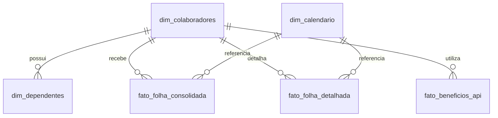

# 📊 ARQ-People Intelligence: Pipeline de Engenharia de Dados de RH


---
### **Cabeçalho de alterações**

|Nome| Data| Versão| Atualização                                                                  |
|-----|-----|------|------------------------------------------------------------------------------|
|João Pedro| 11/02/2026| 1.2|                                                                              |
|João Pedro| 16/03/2026| 1.2| Ajuste da lógica de SCD, onde as SKs estavam mudando após alguma alteração.  |

---
## 📋 Visão Geral
O **ARQ-People Intelligence** é uma solução de Engenharia de Dados end-to-end que centraliza, higieniza e modela o ecossistema de dados de Recursos Humanos. O pipeline atua como um Data Lakehouse especializado, ingerindo dados não-estruturados (PDFs de Folha de Pagamento) e estruturados (APIs de Gestão de Pessoas), consolidando-os em um Data Warehouse modelado para People Analytics.

O diferencial do projeto reside na sua resiliência corporativa: ele foi desenhado para operar em ambientes de rede hostis (Firewalls/Proxies), lidar com grandes volumes de dados via processamento paralelo e garantir consistência transacional (ACID).

1.  **Arquivos Não-Estruturados (PDF):** Holerites, Recibos de Férias e 13º Salário (OCR/Regex).
2.  **API Externa (Sólides):** Dados cadastrais ricos, benefícios e dependentes (REST).

O objetivo final é alimentar um Data Warehouse (PostgreSQL) modelado em **Star Schema** para análises de *People Analytics* (Turnover, Headcount, Custo de Folha, etc.).

---

## 🏗️ Arquitetura do Projeto

O projeto segue uma arquitetura baseada em **Camadas Funcionais,** onde o núcleo da engenharia reside no diretório `src/`, separando claramente as responsabilidades de extração, transformação e carga (ETL).

```text
/
├── input/                 # [Landing Zone] Área transitória (Ephemeral) para ingestão de PDFs brutos.
├── output/                # [Audit Logs] Artefatos de depuração e CSVs para validação de qualidade.
├── logs/                  # [Observability] Registros detalhados de execução e rastreamento de erros.
├── src/                   # [Core Engine] Núcleo de Processamento:
│   ├── database.py        # Connection Factory (Singleton) e gestão de pool PostgreSQL.
│   ├── extract.py         # Ingestion Layer: Cliente FTPS resiliente e Multithreaded API Client.
│   ├── transform.py       # Processing Layer: Normalização, Tipagem Forte (Decimal) e Regras de Negócio.
│   ├── load.py            # Persistence Layer: Gestão de Transações (ACID) e Schema Evolution.
│   ├── utils.py           # Toolkit: Sanitização de Strings e Parsers de Data/Moeda.
│   ├── logger.py          # Telemetry: Configuração centralizada de logs rotativos.
│   └── constants.py       # Configuration: Metadados, De-Para de Rubricas e Schemas.
├── main.py                # Orchestrator: Controlador de fluxo, gestão de dependências e Garbage Collection.
└── .env                   # Security: Segredos, Credenciais e Toggle de Features.
```
----
## ⚙️ Fluxo da Arquitetura do Projeto - Diagramado



``` mermaid
---
config:
  layout: fixed
---
graph LR
    %% --- Fontes ---
    subgraph Sources ["1. Fontes de Dados"]
        FTP[("☁️ Corporate FTP<br/>(Holerites & Férias - PDF)")]
        API["⚡ Sólides API<br/>(Dados Cadastrais & Benefícios)"]
    end

    %% --- Engine ---
    subgraph Engine ["2. Processing Engine (Python Core)"]
        direction TB
        
        subgraph Ingest ["Ingestion Layer"]
            FTPS["🔒 Smart FTPS Client<br/>(Environment Aware)"]
            REQ["🔄 Async API Client"]
        end
        
        subgraph Compute ["Compute Layer (Hybrid Concurrency)"]
            OCR["⚙️ CPU Cluster (Multiprocessing)<br/>OCR & Regex Parsing"]
            PANDAS["🐼 Pandas Transformation<br/>Data Cleaning & Typing"]
        end
    end

    %% --- Storage ---
    subgraph Warehouse ["3. Data Warehouse (PostgreSQL)"]
        STG[(Staging Tables<br/>Ephemeral)]
        DW[(Production Tables<br/>Star Schema)]
        VIEWS[(Analytical Views<br/>Forecasting)]
    end

    %% --- BI ---
    subgraph Analytics ["4. Business Intelligence"]
        PBI[("📊 Power BI<br/>People Analytics")]
    end

    %% --- Fluxo ---
    FTP -->|TLS/Plain| FTPS
    API -->|JSON| REQ
    
    FTPS --> OCR
    REQ --> PANDAS
    OCR --> PANDAS
    
    PANDAS ==>|Upsert Transaction| STG
    STG ==>|ACID Merge| DW
    DW --> VIEWS
    VIEWS --> PBI
    DW --> PBI

    %% --- Estilos ---
    style Warehouse fill:#2C3E50,stroke:#fff,color:#fff
    style Sources fill:#E74C3C,stroke:#fff,color:#fff
    style Engine fill:#ECF0F1,stroke:#333,color:#333
```
----

# 🚀 Detalhamento Técnico dos Módulos (Core Engine)

A engenharia do projeto foi desenhada para garantir resiliência, rastreabilidade e qualidade de dados em cada etapa do pipeline ETL.

## 1. Extração (```src/extract.py```)

Engine responsável pela ingestão de dados heterogêneos.

- 📄 **Processamento de PDF (Unstructured Data):**

   - Utiliza `pdfplumber` para alta fidelidade na extração de texto.

   - **Algoritmo de Parsing Resiliente:** Implementa uma estratégia de Fallback com camadas de Regex. O sistema tenta identificar a competência via padrão primário ("Competência: MM/AAAA"); em caso de falha, recorre a padrões secundários ("Data de Pagamento", "Período de Gozo") para garantir zero perda de dados.

   - **Layout Agnostic:** Capaz de diferenciar e processar layouts distintos (Holerite Mensal vs. Recibo de Férias vs. 13º Salário) no mesmo fluxo.

- ☁**️ Conector de API (Structured Data):**

   - Cliente HTTP robusto para a API da Sólides.

   - **Auto-Pagination:** Implementação de loops (while) com controle de cursor/offset para extração massiva da base de colaboradores sem estourar limites de memória ou rate limits.

## **2. Transformação (```src/transform.py```)**

Camada de Refinaria e Data Quality.

- 🛡️ **Tipagem Forte & Sanitização:**

   - **Normalização Monetária:** Converte strings localizadas (PT-BR R$ 1.000,00) para objetos `Decimal` de alta precisão ou `float` limpos, eliminando erros de arredondamento financeiro.

   - **Tratamento Temporal:** Parser robusto que converte strings de data variadas para objetos `datetime.date`. Valores inválidos (`NaT`, `nan`, strings vazias) são convertidos explicitamente para `None` (SQL NULL), garantindo integridade no banco.

- **Enriquecimento Semântico:**

   - Aplicação de regras de negócio `(constants.py)` para padronizar nomenclaturas de rubricas (De-Para), facilitando a análise posterior no BI.

## **3. Carga (``src/load.py``)**

Camada de Persistência Otimizada.

- **⚡ Performance & Controle:** Utiliza `SQLAlchemy` Core (SQL puro) para operações em lote (bulk operations), superando a performance de ORMs tradicionais.

- **Idempotência (Delete-Insert):** Para tabelas fato (FOPAG), aplica-se a remoção prévia dos dados da competência alvo antes da inserção. Isso permite reprocessamentos infinitos de um mesmo mês sem gerar duplicidade.

- **SCD Tipo 1 (Slowly Changing Dimension):** Na dimensão de colaboradores, utiliza-se a estratégia de Upsert (`INSERT ... ON CONFLICT DO UPDATE`).

   - **Resultado:** O cadastro se mantém sempre atualizado com a última "foto" do colaborador, preservando o ID imutável.

- **Defensive SQL:** Uso de funções `safe_cast` (ex: `CAST(NULLIF(..., '') AS NUMERIC)`) para blindar o Data Warehouse contra quebras causadas por sujeira na fonte.

### **4. Utilitários (`src/utils.py`)**

Toolkit transversal de funções auxiliares:

- **clean_text_series:** Higienização agressiva de strings (remove `\n`, `\t`, non-breaking spaces `\xa0` e normaliza espaçamentos).

- **limpar_valor_moeda:** Resolve a complexidade de Locale (PT-BR vs EN-US), garantindo que` 1.500,50` seja interpretado matematicamente como `1500.50.`

---

# 🔒 Política de Segurança e Retenção de Dados

Tratando-se de dados sensíveis de RH (PII - Personally Identifiable Information), o pipeline implementa uma política de Segurança por Design:

1. **🗑️ Armazenamento Efêmero (Input/Output):**

   - As pastas locais funcionam apenas como buffer de processamento.

   - Política de Retenção: Arquivos brutos (PDFs) e intermediários (CSVs) devem ser expurgados ou movidos para Cold Storage (S3 Glacier/Blob Storage) criptografado imediatamente após o sucesso da carga.

2. **🔑 Gestão de Segredos:**

   - **Zero Hardcoded Credentials:** Nenhuma senha, token ou host de banco de dados é versionado no código.

   - Toda configuração sensível é injetada via Variáveis de Ambiente `(.env)`, seguindo as práticas do 12-Factor App.

---
# ⚙️ Guia de Instalação e Execução
### Pré-requisitos

**🚀 Quick Start**
1. **Configuração de Ambiente** Crie um arquivo `.env` na raiz do projeto com suas credenciais:

```text
# --- DATABASE (Data Warehouse) ---
DB_HOST=localhost
DB_PORT=5432
DB_NAME=dw_rh
DB_USER=postgres
DB_PASS=sua_senha_segura
DB_SCHEMA=fopag_prod

# --- FTP SERVER (Ingestão de PDFs) ---
FTP_HOST=ftp.empresa.com.br
FTP_USER=usuario_leitura
FTP_PASS=senha_ftp
FTP_DIR=/folha_pagamento
# True = FTPS (TLS Explícito) | False = FTP Simples (Legado/Proxy)
FTP_USE_TLS=True

# --- EXTERNAL APIs (Enriquecimento) ---
SOLIDES_API_TOKEN=seu_token_aqui
```

### **2. Estratégia de Ingestão de Arquivos**
O sistema opera em modo híbrido de prioridade:

1. **Prioridade Alta (FTP):** O script tenta conectar ao FTP definido no `.env`. Se encontrar PDFs novos, baixa para a pasta `input/` automaticamente.

2. **Prioridade Local (Fallback):** Se o FTP estiver desativado ou falhar, o script processará qualquer PDF que você tenha colocado manualmente na pasta `input/.`

### **3. Execução do Pipeline**
Inicie o processo de ponta a ponta (Extração -> Transformação -> Carga -> Previsão):

`python main.py`

> Nota: Ao final da execução bem-sucedida, a pasta input/ é limpa automaticamente (Garbage Collection) para evitar reprocessamento duplicado na próxima rodada.

### **4. Validação e Analytics**
Após a mensagem **### PIPELINE FINALIZADO COM SUCESSO ###** no terminal, os dados estarão disponíveis no PostgreSQL:

|Tabela|Finalidade|
|------|----------|
|fopag_prod.fato_folha_detalhada| Dados financeiros da FOPAG detalhados por rubricas|
|fopag_prod.fato_folha_consolidada|Dados financeiros fechados da folha.|
|fopag.prod.dim_calendario| Calendario completo para inteligencia temporal|
|fopag_prod.dim_colaboradores|Cadastro completo (Dados Pessoais + Profissionais).|
|fopag_prod.dim_dependentes|Lista de dependentes vinculados para benefícios.|

### **5. 📐 Diagrama de Arquitetura de Dados (Star Schema)**
O Data Warehouse utiliza uma topologia **Star Schema** (Esquema Estrela), onde a tabela `dim_colaboradores` atua como o centro gravitacional (Hub), conectando dados de folha de pagamento, benefícios e dependentes.

```mermaid
erDiagram
    %% --- Central Dimension ---
    dim_colaboradores ||--o{ dim_dependentes : "possui"
    dim_colaboradores ||--o{ fato_folha_consolidada : "recebe"
    dim_colaboradores ||--o{ fato_folha_detalhada : "detalha"
    dim_colaboradores ||--o{ fato_beneficios_api : "utiliza"
    
    %% --- Calendar Dimension ---
    dim_calendario ||--o{ fato_folha_consolidada : "referencia"
    dim_calendario ||--o{ fato_folha_detalhada : "referencia"
```