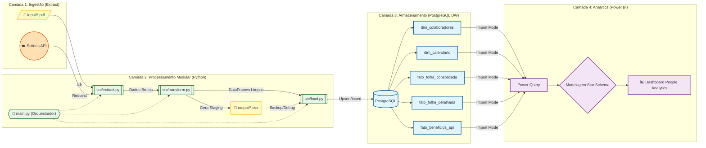

# ARQ-People Intelligence: Pipeline de Engenharia de Dados de RH

## 📋 Visão Geral
Este projeto consiste em um pipeline de **Engenharia de Dados (ETL)** robusto desenvolvido em Python para centralizar, limpar e estruturar dados de Recursos Humanos. O sistema orquestra a ingestão de dados de duas fontes distintas:
1.  **Arquivos Não-Estruturados (PDF):** Holerites, Recibos de Férias e 13º Salário.
2.  **API Externa (Sólides):** Dados cadastrais ricos e benefícios.

O objetivo final é alimentar um Data Warehouse (PostgreSQL) modelado em **Star Schema** para análises de *People Analytics*.

---

## 🏗️ Arquitetura do Projeto

O projeto segue uma arquitetura modular baseada em **Separation of Concerns (SoC)**, onde cada etapa do ETL possui responsabilidade única.

```text
/
├── input/                 # [Área de Staging Local] Recebe os PDFs brutos.
├── output/                # [Área Transiente] Armazena CSVs processados antes da carga.
├── src/                   # Pacote de código fonte principal
│   ├── database.py        # Factory de conexão com o Banco de Dados (Singleton pattern).
│   ├── extract.py         # Lógica de Extração (OCR/Regex para PDF e Requests para API).
│   ├── transform.py       # Limpeza, Tipagem Forte (Pandas) e Regras de Negócio.
│   ├── load.py            # Carga no Banco (DDL, DML, Upserts e Tratamento de Erros).
│   ├── utils.py           # Funções auxiliares (Sanitização de texto e moeda).
│   └── constants.py       # Mapeamento estático de Rubricas e Schemas.
├── main.py                # Orquestrador do Pipeline (Entry Point).
├── renomear_arquivo.py    # Utilitário para padronização de nomenclatura de arquivos.
└── .env                   # Variáveis de ambiente (Credenciais).
```


```mermaid
graph LR
    %% Definição de Estilos
    classDef storage fill:#e1f5fe,stroke:#01579b,stroke-width:2px;
    classDef file fill:#fff9c4,stroke:#fbc02d,stroke-width:2px;
    classDef python fill:#e8f5e9,stroke:#2e7d32,stroke-width:2px;
    classDef bi fill:#f3e5f5,stroke:#7b1fa2,stroke-width:2px;
    classDef api fill:#ffe0b2,stroke:#e65100,stroke-width:2px;

    subgraph "Camada 1: Ingestão (Extract)"
        A[/"📂 input/*.pdf"/]:::file
        B(("☁️ Solides API")):::api
    end

    subgraph "Camada 2: Processamento Modular (Python)"
        Orchestrator{{"🐍 main.py (Orquestrador)"}}:::python
        
        %% Fluxo PDF
        A -->|Lê| Extract[["src/extract.py"]]:::python
        Extract -->|Dados Brutos| Transf[["src/transform.py"]]:::python
        
        %% Fluxo API
        B -->|Request| Extract
        
        %% Saída Transiente
        Transf -->|Gera Staging| C("📄 output/*.csv"):::file
        
        %% Carga
        Transf -->|DataFrames Limpos| Load[["src/load.py"]]:::python
        C -.->|Backup/Debug| Load
    end

    subgraph "Camada 3: Armazenamento (PostgreSQL DW)"
        Load -->|Upsert/Insert| DB[(PostgreSQL)]:::storage
        
        %% Tabelas
        DB --> T1[dim_colaboradores]:::storage
        DB --> T2[dim_calendario]:::storage
        DB --> T3[fato_folha_consolidada]:::storage
        DB --> T4[fato_folha_detalhada]:::storage
        DB --> T5[fato_beneficios_api]:::storage
    end

    subgraph "Camada 4: Analytics (Power BI)"
        T1 & T2 & T3 & T4 & T5 -->|Import Mode| PBI[Power Query]:::bi
        PBI --> Model{Modelagem Star Schema}:::bi
        Model --> Dash[📊 Dashboard People Analytics]:::bi

    %% Conexões do Orquestrador
    Orchestrator -.-> Extract
    Orchestrator -.-> Transf
    Orchestrator -.-> Load
    end
```
----

# 🚀 Detalhamento Técnico dos Módulos

## 1. Extração (```src/extract.py```)


- **PDFs** : Utiliza a biblioteca ```pdfplumber``` para extração de texto bruto. **Aplica Expressões Regulares (Regex)** complexas para identificar padrões de layout variáveis (Holerite Mensal vs. Recibo de Férias).

  - Estratégia de Fallback: O extrator possui múltiplas camadas de regex. Se não encontrar o padrão "Competência: MM/AAAA", busca por "Data de Pagamento" ou "Período de Gozo".
- **API**: Implementa paginação automática (```while loop```) para iterar sobre todos os endpoints da API da Solides, garantindo a extração completa da base de colaboradores.

## 2. Transformação (```src/transform.py```)

Focada em **Data Quality** e **Tipagem Forte.**

- **Sanitização**: Converte strings monetárias brasileiras ('R$ 1.000,00') para objetos ``Decimal`` ou ``float`` limpos.

**Tratamento de Datas**: Converte strings para objetos ``datetime.date``, transformando valores inválidos (``NaT``, ``nan``) explicitamente em ``None`` (NULL) para evitar erros no banco.

**Enriquecimento**: Padroniza nomes de rubricas baseados em um dicionário de-para (``constants.py``).

## 3. Carga (``src/load.py``)

Utiliza SQLAlchemy e SQL puro para máxima performance e controle.

**Idempotência**: A carga de fatos utiliza a estratégia *Delete-Insert* baseada na competência. Isso permite reprocessar um mês inteiro sem duplicar dados.

**SCD Tipo 1 (Upsert)**: A dimensão de colaboradores utiliza ``INSERT ... ON CONFLICT DO UPDATE`` para garantir que o cadastro esteja sempre atualizado, mantendo o ID imutável.

**Segurança de Tipos**: Implementa funções ``safe_cast`` no SQL (``CAST(NULLIF(..., '') AS NUMERIC``)) para blindar o banco contra strings vazias ou caracteres sujos vindos da fonte.

---

# 🔒 Política de Segurança e Retenção de Dados

Este pipeline lida com Dados Pessoais Sensíveis (LGPD). As seguintes regras são aplicadas via código e processo:

1. **Pasta ``input/`` (PDFs)**: Destinada apenas para leitura momentânea. Após a execução do pipeline e validação, os arquivos devem ser excluídos ou movidos para um armazenamento frio seguro (Cold Storage/S3).

2. **Pasta ``output/`` (CSVs)**: Arquivos gerados apenas para debug e transporte (Staging). Devem ser **excluídos** imediatamente após a confirmação da carga no banco.

3. **Credenciais**: Nenhuma senha é hardcoded. Tudo é gerenciado via variáveis de ambiente (``.env``).

---
# ⚙️ Como Executar
### Pré-requisitos
- Python 3.9+
- PostgreSQL 12+
- Dependências listadas em requirements.txt

### Passo a Passo

1. Configure o arquivo ```.env``` na raiz:
    ```text
    DB_USER=postgres
    DB_PASS=sua_senha
    DB_HOST=localhost
    DB_PORT=5432
    DB_NAME=dw_rh
    DB_SCHEMA=fopag_prod
    SOLIDES_API_TOKEN=seu_token
    ```
2. Coloque os PDFs na pasta ``input/.``.
3. (Opcional) Padronize os nomes dos arquivos:
   ```bash
   python renomear_arquivo.py
   ```
4. Execute o Pipeline principal:
   ```bash
   python main.py
   ```